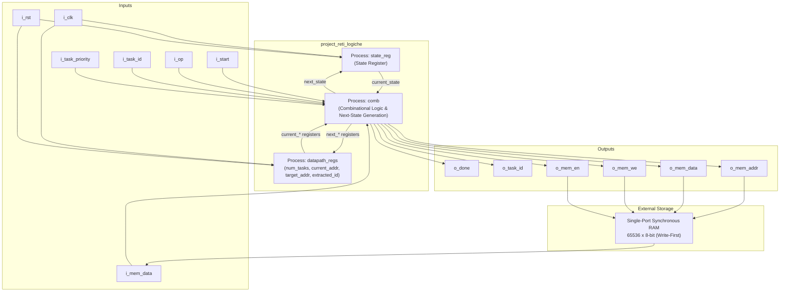
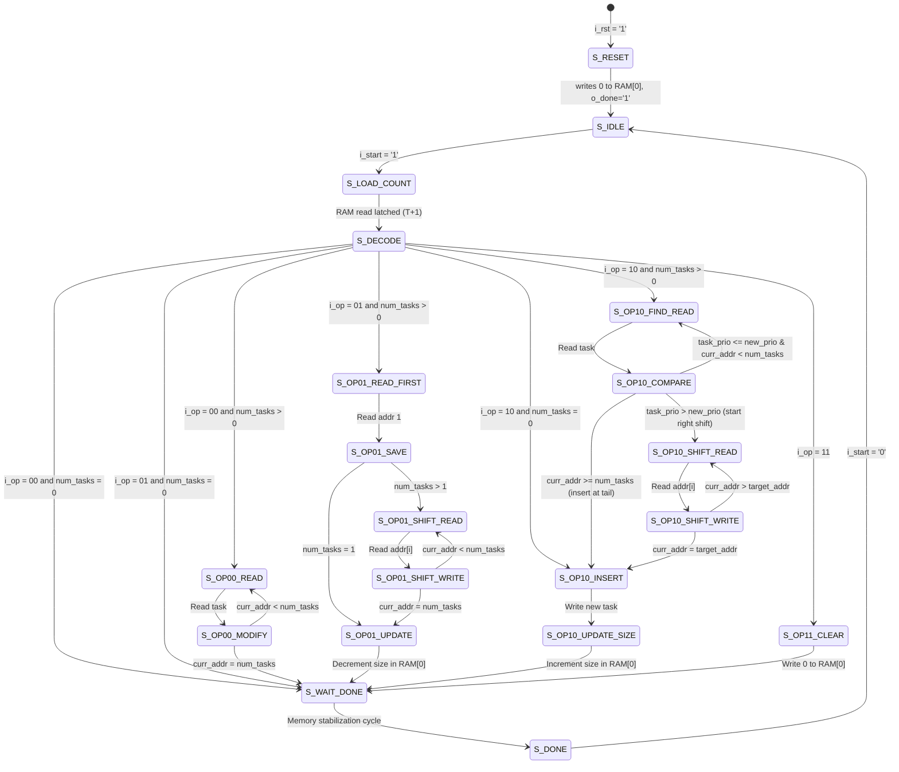

# Logic Networks Project (Progetto Reti Logiche)

> **Academic Year 2025–2026** — *Politecnico di Milano*  
> **Course:** Reti Logiche (Logic Networks)  
> **Professor:** Fabio Salice  
> **Authors:**  
> - Riccardo Mattia (Student ID: 10893716)  
> - Luca Pietro Messenio (Student ID: 10912026)  

Comprehensive documentation and report: [10893716_10912026-10.pdf](./10893716_10912026-10.pdf)

---

## 1. Project Overview

The objective of this project is the hardware implementation in **VHDL** of a digital controller that manages a **priority queue / sorted task list** stored in an external single-port synchronous RAM (65536 × 8-bit, write-first mode).

The core module operates under a standard **handshake protocol** (`i_start` / `o_done`) and supports four fundamental queue operations:
- Priority demotion across all active tasks (with saturation).
- Extraction (pop) of the highest-priority task.
- Insertion of a new task maintaining sorted priority order and FIFO order for equal-priority tasks.
- Instant list clearing.

---

## 2. Memory Organization & Task Encoding

### Memory Layout
- **Address `0` (`RAM[0]`):** Stores the 8-bit integer `num_tasks`, indicating the count of currently valid tasks in the list (0 to 255).
- **Addresses `1` to `N` (`RAM[1 .. num_tasks]`):** Store the task records in **ascending order of priority value** (lower numerical priority value = higher logical priority).

### 8-bit Task Format
Each task is encoded into a single 8-bit byte:
```text
+-----------------------+-------------------+
|  Bits [7:2] (6 bits)  | Bits [1:0] (2 bits)|
|       ID_TASK         |     PRIORITY      |
+-----------------------+-------------------+
```
- **`ID_TASK` (6 bits, values 1..63):** Unique identifier of the task.
- **`PRIORITY` (2 bits, values 0..3):**
  - `00` (0): Maximum / Highest priority.
  - `01` (1): High priority.
  - `10` (2): Medium priority.
  - `11` (3): Minimum / Lowest priority.

---

## 3. Supported Operations (`i_op`)

| `i_op` | Operation | Description |
| :---: | :--- | :--- |
| **`00`** | **Priority Decrement (Demotion)** | Sequentially scans all stored tasks and increments their priority value by 1 (demoting priority), with upper saturation at `11` (priority 3). Tasks already at priority 3 remain unchanged. |
| **`01`** | **Extract First Task** | Removes the highest-priority task (at address 1), returns its 6-bit `ID_TASK` on `o_task_id`, left-shifts all subsequent tasks by 1 position (`addr[i] -> addr[i-1]`), and decrements `num_tasks`. If the queue is empty, returns ID 0 without modifying memory. |
| **`10`** | **Task Insertion** | Inserts a new task (`i_task_id`, `i_task_priority`) in the correct position according to priority. Equal-priority tasks are placed in FIFO order (new task after existing identical-priority tasks). Shift right (`addr[i] -> addr[i+1]`) is performed to make room, followed by incrementing `num_tasks`. |
| **`11`** | **Clear List** | Immediately resets the queue by writing `0` to address `0`. Valid tasks are determined strictly by the size counter, completing the clear operation in a single write cycle. |

---

## 4. Hardware Architecture

The design follows a clean **FSM + Datapath** separation implemented using a robust three-process template in VHDL:

1. **`state_reg` (Synchronous with Asynchronous Reset):**
   - Driven by `i_clk` (rising edge) and active-high asynchronous reset `i_rst`.
   - On reset, forces `current_state <= S_RESET`. Otherwise advances `current_state <= next_state`.
2. **`datapath_regs` (Synchronous Datapath Flip-Flops):**
   - Latches internal datapath registers on the rising edge of `i_clk`: `num_tasks`, `current_addr`, `target_addr`, and `extracted_id`.
3. **`comb` (Combinational Logic & Next-State Decoder):**
   - Complete sensitivity list to avoid synthesis-simulation mismatches.
   - Sets safe default values at the top of the process to ensure **0 latches** are inferred.
   - Generates next states (`next_*`) and control outputs (`o_mem_addr`, `o_mem_data`, `o_mem_we`, `o_mem_en`, `o_done`, `o_task_id`).

### Block Diagram



---

## 5. Interface Signals

| Signal | Direction | Width | Description |
| :--- | :---: | :---: | :--- |
| `i_clk` | IN | 1 | Master clock (sampled on rising edge). |
| `i_rst` | IN | 1 | Asynchronous active-high system reset. Forces FSM into `S_RESET`. |
| `i_start` | IN | 1 | Handshake input: asserted high by testbench to start an operation. |
| `i_task_id` | IN | 6 | ID of the task to insert (used by `OP=10`, values 1..63). |
| `i_task_priority` | IN | 2 | Priority of the task to insert (`00`=max, `11`=min). |
| `i_op` | IN | 2 | Operation selection code (`00`, `01`, `10`, `11`). |
| `o_done` | OUT | 1 | Handshake completion output (asserted in `S_DONE`). |
| `o_task_id` | OUT | 6 | Extracted task ID (produced by `OP=01`, returns 0 if empty). |
| `o_mem_addr` | OUT | 16 | External RAM address bus (address range 0..65535). |
| `i_mem_data` | IN | 8 | Data read from external RAM (valid 1 cycle after read request). |
| `o_mem_data` | OUT | 8 | Data to write into external RAM. |
| `o_mem_we` | OUT | 1 | Memory write enable (`1` = write, `0` = read). |
| `o_mem_en` | OUT | 1 | Memory enable signal (`1` on every memory access). |

---

## 6. Finite State Machine (FSM)

The control unit is modeled as an extended Mealy/Moore FSM designed around synchronous memory timing:



### State Description Table

| State | Purpose |
| :--- | :--- |
| `S_RESET` | Emits memory write `0` at address `0` and sets `o_done = '1'`. Next clock cycle enters `S_IDLE`. |
| `S_IDLE` | Awaits `i_start = '1'`. `o_done = '0'`. |
| `S_LOAD_COUNT` | Sends read request to RAM address `0`. |
| `S_DECODE` | Receives `num_tasks` from `i_mem_data`. Performs immediate empty-list check and branches to the selected operation. |
| `S_OP00_READ` | Sends read command for current task address (`current_addr`). |
| `S_OP00_MODIFY` | Checks priority: if `< 3`, increments it and rewrites to RAM. Loops back to `S_OP00_READ` or goes to `S_WAIT_DONE`. |
| `S_OP01_READ_FIRST` | Requests reading address `1` (task to be popped). |
| `S_OP01_SAVE` | Saves `extracted_id` in register. If `num_tasks = 1`, goes to `S_OP01_UPDATE`; otherwise starts left-shift. |
| `S_OP01_SHIFT_READ` | Reads `RAM[current_addr]`. |
| `S_OP01_SHIFT_WRITE` | Writes data into `RAM[current_addr - 1]`. Loops until `current_addr = num_tasks`. |
| `S_OP01_UPDATE` | Writes updated `num_tasks - 1` into address `0`. |
| `S_OP10_FIND_READ` | Reads task at `current_addr` to compare priority. |
| `S_OP10_COMPARE` | If task has lower priority (`priority > i_task_priority`), sets `target_addr` and initiates right-shift; if end of list reached, jumps directly to `S_OP10_INSERT`. |
| `S_OP10_SHIFT_READ` | Reads `RAM[current_addr]` from tail towards `target_addr`. |
| `S_OP10_SHIFT_WRITE` | Writes data into `RAM[current_addr + 1]`. Decrements address until `target_addr` is freed. |
| `S_OP10_INSERT` | Writes the new task byte into `target_addr`. |
| `S_OP10_UPDATE_SIZE` | Writes incremented `num_tasks + 1` into address `0`. |
| `S_OP11_CLEAR` | Writes `0` into address `0`. |
| `S_WAIT_DONE` | Dedicated 1-cycle pipeline buffer ensuring RAM write consolidation before raising handshake. |
| `S_DONE` | Asserts `o_done = '1'`. Awaits `i_start = '0'` before returning to `S_IDLE`. |

---

## 7. Key Design Choices & Timing Considerations

### Synchronous RAM Latency (Write-First)
The synchronous RAM presents a 1-clock-cycle read latency (request emitted at cycle $T$, data available at cycle $T+1$). All multi-element operations employ a two-cycle read-and-process schedule to pipeline address generation and data handling without hazards.

### Centralized Empty-List Verification in `S_DECODE`
Rather than introducing redundant check-states inside each operational branch, `S_DECODE` performs the check directly:
- If `num_tasks = 0` during `OP00` or `OP01`, the controller transitions immediately to `S_WAIT_DONE`, saving multiple clock cycles and eliminating unused logic.
- During `OP10` on an empty list, it bypasses the search and shift loops directly to `S_OP10_INSERT`.

### Memory Stabilization with `S_WAIT_DONE`
In write-first synchronous RAMs, asserting `o_done` combinatorially in the same cycle an address is written creates a race condition for testbenches that sample memory on `rising_edge(o_done)`. Inserting `S_WAIT_DONE` introduces an intentional 1-cycle latency, guaranteeing memory contents are fully consolidated before `o_done` goes high.

---

## 8. Experimental Results & Synthesis (Xilinx Vivado)

Post-synthesis and behavioral simulations were conducted targeting Xilinx FPGA architecture with a **20.0 ns (50 MHz)** clock constraint.

### Implementation Metrics Summary

| Metric | Measured Value | Constraint / Limit | Notes |
| :--- | :---: | :---: | :--- |
| **Functional Simulation** | **PASSED** | All 9 steps | Execution time: 2 µs |
| **Clock Period** | **20.0 ns** | 50 MHz | Timing closed with positive slack |
| **Slice LUTs** | **210** | 0.51% utilization | Minimal area footprint |
| **Slice Registers (FF)** | **66** | 0.08% utilization | Datapath and state registers |
| **Registers as Latches** | **0** | **0** (Strict requirement) | Purely synchronous design |
| **Data Path Delay (Worst-Case)** | **5.424 ns** | < 20.0 ns | 69.2% logic, 30.8% routing |
| **Logic Levels** | **9** | — | CARRY4 (4), FDCE (1), LUTs (3), OBUF (1) |
| **Estimated Max Frequency ($F_{max}$)** | **~184.3 MHz** | > 50 MHz | Substantial timing margin (> 3.6x) |

---

## 9. Verification & Ad-Hoc Testbench Suite

In addition to the official testbench (`tb2526.vhd`), a dedicated edge-case verification suite was developed in the [`test_bench/`](./test_bench/) directory:

- **`tb_edge_01_remove_empty.vhd`**: Verifies `OP01` extraction on an empty queue (returns `o_task_id = 0`, memory unchanged).
- **`tb_edge_02_decrpri_empty.vhd`**: Verifies `OP00` demotion on an empty queue without spurious memory writes.
- **`tb_edge_03_saturation_p3.vhd`**: Verifies priority demotion upper-bound saturation (`11` remains `11` without overflow).
- **`tb_edge_04_mixed_sat.vhd`**: Evaluates mixed lists containing tasks at various priorities including saturation points.
- **`tb_edge_05_insert_empty.vhd`**: Verifies insertion into an initially empty list.
- **`tb_edge_06_insert_p0_head.vhd`**: Tests inserting a maximum-priority task (`00`) at the head of a non-empty list.
- **`tb_edge_07_insert_p3_tail.vhd`**: Tests inserting a lowest-priority task (`11`) at the tail of the list.
- **`tb_edge_08_insert_same_prio.vhd`**: Validates FIFO ordering preserves relative order among equal-priority tasks.
- **`tb_edge_09_async_reset.vhd`**: Verifies asynchronous reset recovery mid-operation during active memory writes.
- **`tb_edge_10_clear_then_remove.vhd`**: Tests clearing a populated list followed immediately by an extraction request.
- **`tb_edge_11_double_reset.vhd`**: Ensures consecutive reset pulses maintain stability and protocol integrity.

---

## 10. Project Artifacts & Schematics

- **Official Project Report:** [10893716_10912026-10.pdf](./10893716_10912026-10.pdf)
- **Top-Level Block Diagram:** [schema_a_blocchi.drawio-2.pdf](./schema_a_blocchi.drawio-2.pdf)
- **Datapath Schematic:** [DataPath.drawio-4.pdf](./DataPath.drawio-4.pdf)
- **FSM State Transition Diagram:** [FSM_progetto_reti.drawio-10.pdf](./FSM_progetto_reti.drawio-10.pdf)
- **Primary Source Code:** [project_reti_logiche.vhd](./project_reti_logiche.vhd)
- **Memory Simulation Model:** [rams_sp_wf.vhd](./rams_sp_wf.vhd)
- **Official Testbench:** [tb2526.vhd](./tb2526.vhd)
